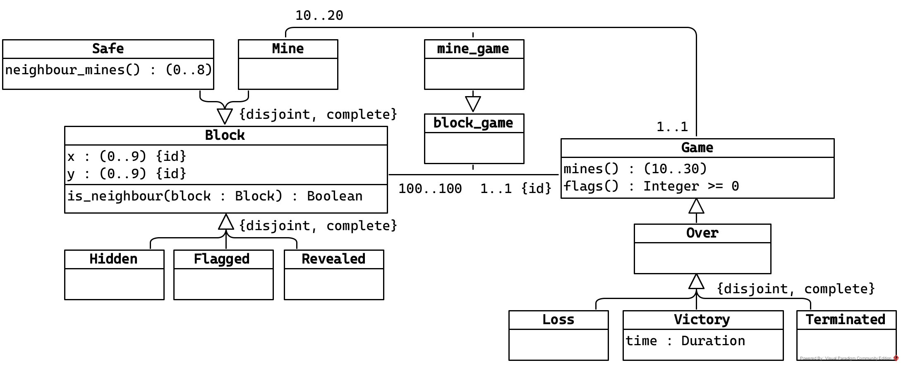
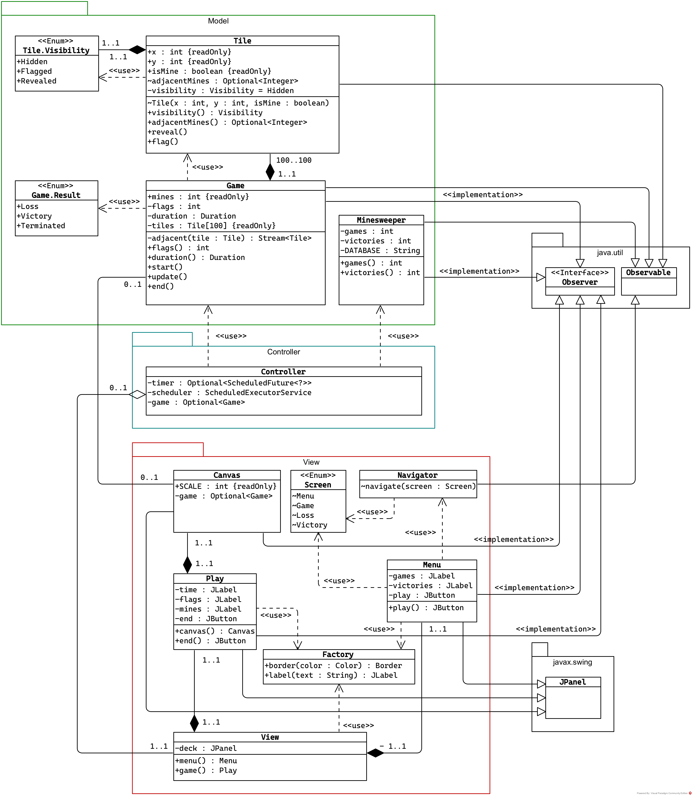

# Minesweeper

> The game features a grid of clickable *tiles*, with hidden _"mines"_ (depicted as naval mines in the original game) scattered throughout the board. The objective is to _clear the board_ without detonating any mines, with help from clues about *the number of neighboring mines in each field*
> ([Wikipedia](https://en.wikipedia.org/wiki/Minesweeper_(video_game)))

## Analisi

Di seguito i diagrammi sviluppati durante l'analisi del gioco. Per l'analisi più completa consultare la [specifica di progetto](https://github.com/CuriousCI/minesweeper/blob/main/docs/main.pdf).

### UML ad alto livello

Modello sviluppato in una prima analisi ad alto livello del gioco (eventuali vincoli sui dati e specifiche delle operazioni sono definite nella [specifica di progetto](https://github.com/CuriousCI/minesweeper/blob/main/docs/main.pdf)).

### UML implementazione 

Modello che sintetizza l'implementazione del progetto. Per una visione più completa è possibile consultare la [documentazione online](https://curiousci.github.io/minesweeper/) in javadoc.

### Wireframe dell'interfaccia

Breve progetto dell'interfaccia grafica.

